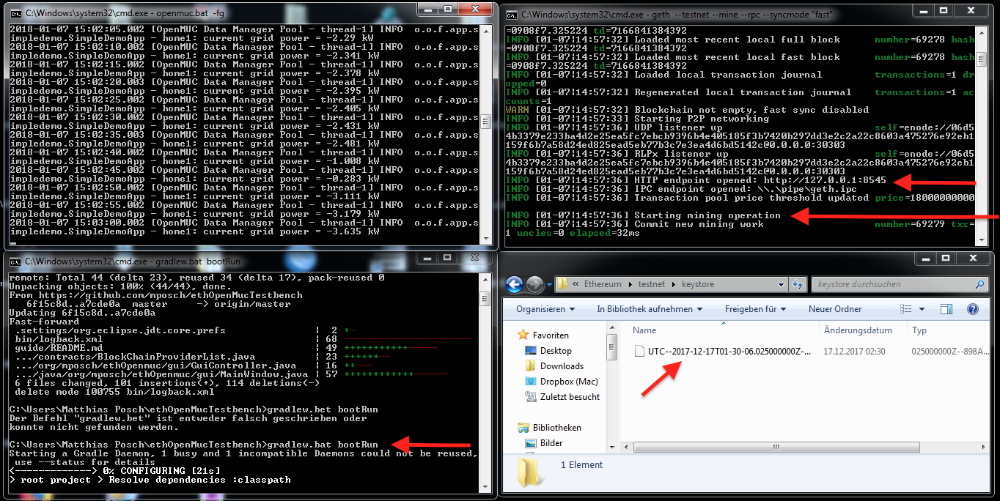
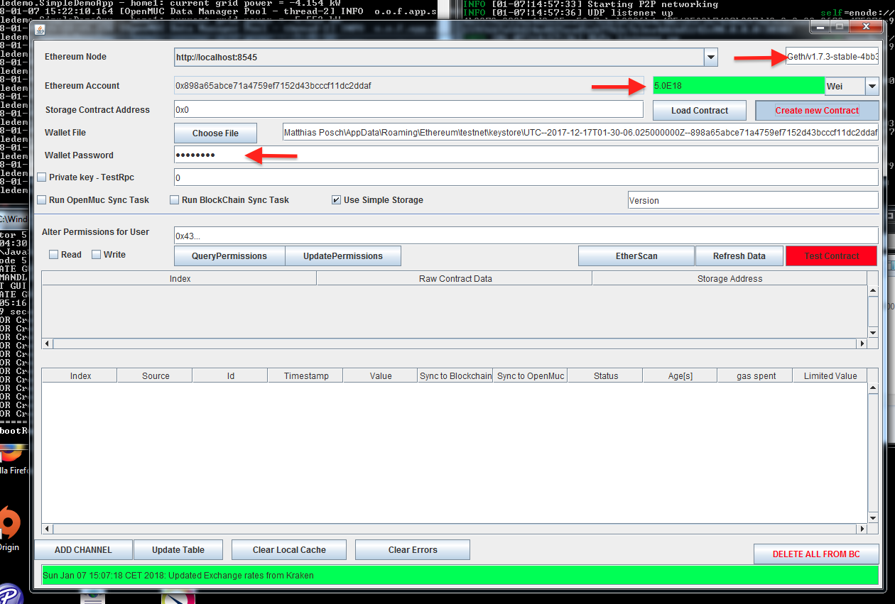

# Installing the EthTestbench on a Windows machine, step by step Quick Start Guide
Requirements: Java JRE, (Git), OpenMuc

## Install a Java JDK
 

Your system must be configured to host a Java JRE Environment and the Java JDK must be available to compile the source. 
I tested the commande using JDK Update 151. 

 
## Install Geth for Windows

Download the installer at https://geth.ethereum.org/downloads/
I this guide i used version 1.7.3

Once the installer is finished , open a command window. The first step is to create an account using the commandline tool:

	geth --testnet account new

The programm will ask for a password (which is used to encrypt the private keys which are stored in the keyfile). A wallet file will be created at the default Ethereum location. 

 Afterwards, to start the ethereum node,  geth can be executed again using following options

	geth --testnet --mine --rpc --syncmode "fast"

This will start the ethereum blockchain node, with mining enabled in order to be able to perform transactions. The sync process will take a while, when ste process is started for the first time let it work for approximately 30 minutes. It will take some time for the ethereum node to sync with the test network and perform mining operations. 

In another terminal window, verify that geth is running correctly:

	geth attach

Will open a shell connection to the already running Ethereum Node. The Output should look similar to his:
```
C:\Users\Matthias Posch>geth attach
Welcome to the Geth JavaScript console!

instance: Geth/v1.7.3-stable-4bb3c89d/windows-amd64/go1.9
coinbase: 0x898a65abce71a4759ef7152d43bcccf11dc2ddaf
at block: 51966 (Sun, 27 Nov 2016 17:30:18 CET)
 datadir: C:\Users\Matthias Posch\AppData\Roaming\Ethereum\testnet
 modules: admin:1.0 debug:1.0 eth:1.0 miner:1.0 net:1.0 personal:1.0 rpc:1.0 txp
ool:1.0 web3:1.0
>
```
There are a number of commands that can be used to interact with the blockchain. Most of these functions can also be accessed using the Ethereum wallet or the Ethereum Mist Browser, which both use the geth process internally. The shell can be used to check the state of the Network:
```
> personal.listAccounts
["0x898a65abce71a4759ef7152d43bcccf11dc2ddaf"]
> miner.getHashrate()
1599
> net.version
"3"
> net.peerCount
3
> net.listening
true
>

```

## Install Openmuc

Download the latest Version of Openmuc from https://www.openmuc.org/openmuc/download/
In this guide i will use version 0.16.0.

2) Unpack the downloaded archive, and use a terminal session to launch the openmuc demo using 

	openmuc.bat -fg

This script is located in the framework/bin directory

as described in the OpenMuc [quick start guide](https://www.openmuc.org/openmuc/user-guide/#_quick_start). 
This will start a the OSGI framework (Apache Felix) and launch the demo project, which can be interfaced by this project.
### Verify Openmuc
It is easy to verify that openMuc is running by visiting the webpage that will be available (http://localhost:8888)


## Install Git

I would recommend to use git to checkout the latest version of the repository. To install git for windows just download the latest version at (http://msysgit.github.io)

And then use the clone command in a terminal window to download the Project. The project will be downloaded wherever to the current directoriy of the shell. 
	
	git clone https://github.com/mposch/ethOpenMucTestbench.git

If you do not want to install git, you can just download the master zip file from github: https://github.com/mposch/ethOpenMucTestbench/archive/master.zip

To actually run the software just type

	cd ethOpenMucTestbench
	gradlew.bat bootRun

This will download all dependencies, compile the source code, start the spring framework and launch the application. 

## Selecting the Keyfile

These can be found at these locations:
Accounts

    Mac: ~/Library/Ethereum/keystore
    Linux: ~/.ethereum/keystore
	Windows: %APPDATA%/Ethereum/keystore

The Projects needs the keyfiles to access the Private keys of an account, in order to sign transactions correctly. 
To access the keyfile it might be necessary to allow the Explorer to view hidden files and folders. For the test network it is necessary to locate the keyfile in the testnet folder. 

After this initial steps the demo should be ready to connect to OpenMuc and the Ethereum Testnet. Below is a screenshot how the setup could look like: 



After that, the running Project should look like this:



